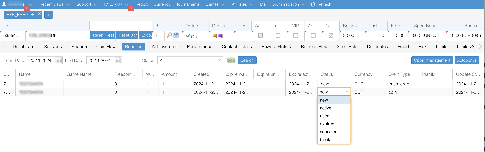
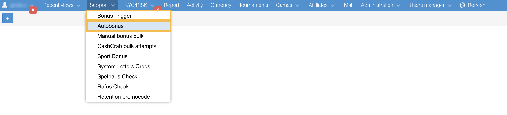
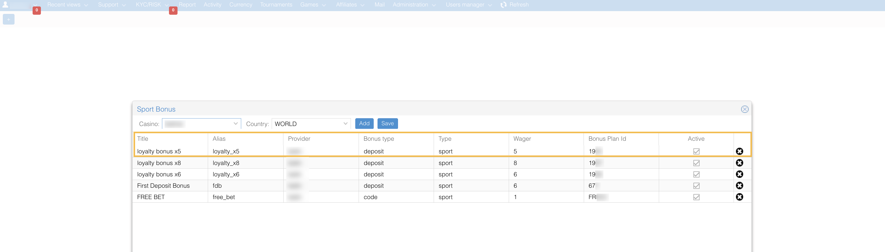

# Autobonuses
The platform enables you to create casino, sport bonuses, and promotions to reward loyal players and attract new ones. The NR1 setup includes autobonus configuration while bonuses description and other elements of design on the brand website should be configured in the Content Management System (CMS). Each promotion in CMS is linked to NR1 autobonuses using the GUID parameter, automatically generated in NR1, and required for every CMS promotion. For more information how to create promotions, see **Content Management System** > **Promotions** article.

When working with bonuses, keep in mind the following rules:
* The bonus funds cannot be withdrawn unless they are wagered.
* Players can access their bonus funds only if they have already lost the full Real balance.
* Only one bonus can be activated at a time. If a player activates the second bonus, the first one will be canceled.

The funds received by the player within a reward promotion must be deposited into separate types of balance. Due to this feature, the total player's balance may divided into the following types of balance: bonus, real, and virtual currency. 
* The real balance shows the amount of money the player credits via deposits and various cash bonuses. The player can withdraw funds from the real balance or use them to continue playing. 
* The bonus balance shows the bonus money the player can use to continue playing. 
* The total balance shows a sum of real and bonus balances. 
* The virtual currency balance shows virtual currencies specific to a project, such as loyalty points.

## Bonus statuses
Once the player meets the requirements for receiving a bonus, the bonus is credited with the **New** status till the player activates it. You also may activate the player’s bonus via NR1. Keep in mind that the player may have only one bonus in the **Active** status.

Available statuses:
* **New**: Bonus has been created but hasn’t been activated yet.
* **Active**: Bonus has been activated by the player on the web service or via NR1. 
* **Canceled**: Bonus has been canceled by the player on the web service or via NR1. 
* **Released**: Bonus rollover requirements have been met; the player may withdraw their winnings.
* **Used**: Bonus has been activated, and all bonus money has been spent, but the player hasn’t met the rollover requirements. 
* **Expired**: Bonus hasn’t been activated, or the rollover requirements haven’t been completed within the bonus expiration date (for example, 240 hours).

## Autobonuses configuration
The platform supports two ways of adding new bonuses, depending on the configuration:
* **Support** > **Autobonus** tab
* **Support** > **Bonus trigger** tab

For example, if a bonus contains several currencies, you need to create it via the **Bonus trigger** functionality.
The description on how to create a bonus trigger provided below and contains extended settings, so you can use this description when creating autobonuses as well.

To add a new bonus trigger, click the **Create New** button, and then specify autobonus parameters in accordance with the Terms and Conditionals for the bonus:

* **Enabled**: Checkbox that activates this bonus. 
* **Is affiliate**: Checkbox that indicates this bonus is configured for a specific Affiliate partner. If enables, the **Affilaite** field will appear at the bottom of the dialog. 
* **Opt-in**: Checkbox that allows you to configure this bonus using an opt-in bonus logic (to receive this type of bonus, players have to opt in). 
* **Casino** or **Projects**: Project name for which this bonus is configured. 
* **Name**: Name of the autobonus. 
* **GUID**: Bonus identifier automatically generated on the platform side when you create a bonus. This parameter must be specified for every promotion in CMS. 
* **Comment**: Description of the autobonus. 
* **Exclude Paymethods**: Payment methods for which the bonus is unavailable. When configure payment methods via the Bonus trigger functionality, you can select the rule type: **exclude** marked payment methods or **include**. 
* **Affiliate**: Affiliate identifier. 
* **Promocode** or **Promocode (entity dep)**: Affiliate promotion codes used during registration. 
* **Achievement**: Achievement name. 
* **Retention PC**: Promotional code created for trigger retention bonuses. 
* **Trigger** or **Trigger event**: Event or player’s action that triggers a bonus.
  - **Login**: Players will receive a bonus after logging in.
  - **Register**: Players will receive a bonus after successful registration.
  - **Deposit**: Players will receive a bonus when they make a deposit.
  - **Achievement**: Players will receive a bonus, once they get an achievement-special events aimed to reward players for their activity.
  - **Promocode_activate**: Players will receive a bonus when they use promotional codes.
  - **Total_bets**: Player will receive a bonus if they’ve made the required number of bets within the specified provider.
  - **Promo_campaign**: Trigger for promo campaigns like Summer promo or Octoberfest.
* **Type**: Trigger type.
  - **First–Sixth Deposits**: Players get bonuses for each first, second, and third deposit, etc.
  - **Weekly**: Players will get a bonus each week they make the first deposit.
  - **Weekend**: Players will get a bonus at the weekend (Friday - Sunday) after they make the first deposit this weekend.
  - **Once by period**: Players will get a bonus when they make this period’s first deposit
* **Amount**: Percentage-based bonus amount (e.g., "100.00%" for 100% bonus). This option is available if the **Deposit** trigger is set. To specify percentages, use the 100.00% format.
* **Wager**: Number of times a bonus must be wagered before any bonus money can be withdrawn. 
* **Min deposit amount**: Minimum deposit amount required to receive a bonus. It is available if the **Deposit** trigger is set. If multiple currencies are used, you should specify the amounts for each currency. If left this field empty, the bonus will be available for any deposit amount. 
* **Max bonus amount**: Maximum bonus amount a player can receive. It is available if the **Deposit** trigger is set. If your project has more than one currency, you should specify amounts for each. If this field is empty, a bonus amount is unlimited. You don’t need to specify this value for freespin bonuses. 
* **Weight**: Parameter used for bonus prioritization if several bonuses are triggered. For example, if a player meets the condition to get several bonuses for one deposit, they will get a bonus with the highest weight. The following values can be used: 
  * First deposit bonus: 10 
  * Second deposit bonus: 9 
  * Third deposit bonus: 8 
  * Fourth deposit bonus: 7 
  * Weekend: 7 
  * Weekly bonus: 6 
  * Registration: 11
* **Game Systems**: Game provider name. 
* **Country**: List of countries where bonuses are available. To choose the list of required countries, click **Select all countries**, and after that, deselect the countries where bonuses are restricted. 
* **Currency** (available in the **Bonus trigger** tab): This bonus is available for a specified currency. If the player's currency differs from the one set in the autobonus settings, a conversion will be performed using the base currency according to the open exchange rate, which is updated daily in the database. 
If several currencies applied, you need to specify the minimum and maximum deposit amount for each of them. 

* **Expire** or **Start** and **End**: Time when this bonus is available (240 hours by default). 
* **Amount %**: Bonus amount in the percentage of the deposit amount. To apply, the **Amount type** value should be set as "percent". 
* **Max bonus release amount**: Percentage of the bonus amount (in percents or as a fixed value) that can be released to the player's real balance. 
* **Start/End**: Timeframe for bonus availability. 
* **Activation rules**: 
  * Minimal deposit amount: Deposit amount required to receive the bonus. 
* **Extended rules**: Contains the tools to configure rules that player has to follow to receive the bonus: 
  * Number of days from the moment of registration. 
  * Number of days since the last deposit. 
  * Number of days since the last login. 
  * Number of deposits from the moment of registration. 

### Freespins
If you want to create freespins, click the **Freespins** button and then specify additional parameters:

* **Freespin Min**: Minimum deposit required for freespins. Also, select Freespins providers.  
* **Game**: Name of the game for which freespins can be used. 
* **Amount**: Number of freespins awarded. 
* **Repeat**: Number of times a player can receive freespins. If the repeat amount is greater than 1, the player will get free spins every 24 hours for a specified number of times. Every freespin bonus has a **New** status and can be activated by the player at any time. Previously issued free spins are not canceled if the player gets a new one. 

### Coin bonus
If you want to add a coin bonus, specify the parameters: 
* Amount: Amount of coins that must be credited. 
* Reward type: Select "coins". 
* Retention bonus type: "Deposit" or "Total_bet". 

### Sport bonus
If you want to create a sport bonus, click the **Sport Bonus** button and then specify additional parameters:
* **Provider**: Sport provider name. 
* **Name**: Sport value should be used. 
* **Amount**: Credited amount of money. 
* **Bonus plan alias (entity dep)**: Alias for a sport bonus plan for the current project.

To create Sport bonus plan (alias) go to **Support** > **Sport Bonus**. Fill the general details and click **Add**:

* **Casino**: Name of your project. 
* **Country**: Country where this bonus plan can be applied.

Then, fill the bonus plan parameters:

* **Title**: Sport bonus plan title.
* **Alias**: Bonus plan alias unique value.
* **Provider**: Sport provider name.
* **Bonus type**: Deposit or code.
* **Type**: Should be selected 'Sport'.
* **Wager**: Wager value for the current sport bonus plan.
* **Bonus plan ID**: Bonus plan identifier.
* **Active**: Checkbox for activating a sport bonus plan.

### Opt-in bonus
The opt-in bonus is a bonus a player has to sign up for. As a rule, there are weekly reload, weekend reload and cashback bonuses. Weekly opt-in bonuses are available from Mondays to Thursdays, and weekend bonuses from Friday to Sunday each week. These bonuses are credited after a successful deposit.
1. To configure opt-in bonuses, open **Bonus trigger** page > **Create bonus trigger**. 
2. In the dialog, do the following:
   - Select the **Opt-in** checkbox.
   - **Trigger event**: Choose **Deposit**.
   - **Type**: Choose **Weekend** or **Weekly**.
   - Specify a **Sub type**: **Weekly reload** or **Weekend reload**.

Note that players can be opted-in and opted-out manually on the player's dashboard > Bonuses tab.

#### Cashback bonus 
The cashback bonus is a type of the opt-in bonus. If a player opts-in, they will receive a weekly cashback bonus provided that they make deposits and play casino games. The bonus ic credited for 4 weeks and each week the player's activity is evaluated. 
1. To configure cashback bonuses, open **Bonus trigger** > **Create bonus trigger**. 
2. In the dialog, do the following:
   - Select the **Opt-in** checkbox.
   - **Trigger event**: Choose **Simplify**.
   - Specify a **Sub type**: **Cashback**.

### Use case
> **How to add 100% + 200 FS first deposit bonus**.
When creating a first deposit bonus that includes a percentage of the deposit amount and free spins, make sure to set the same minimum deposit amount for both the cash bonus and the free spins.
> 
> For example, in accordance with the Terms and Conditional a player is able to receive a bonus after making the first deposit, that should be 80 PLN or more.
Therefore, in NR1 you need to create a new autobonus with the trigger: deposit, trigger type: first deposit, and specify the minimum amount 80.
>
> 

## Autobonus trigger codes
Autobonus trigger codes are used to display bonuses correctly on the web service. They must match corresponding promotions in the CMS system. To add autobonus triggers, go to **Administration** > **Autobonus Triggers**. In the **Casino** field in the lower-left corner, select your project and specify the following parameters:
* **Code**: Unique code name. 
* **Type**: Promotion. 
* **Comment**: Description of the trigger type. 

