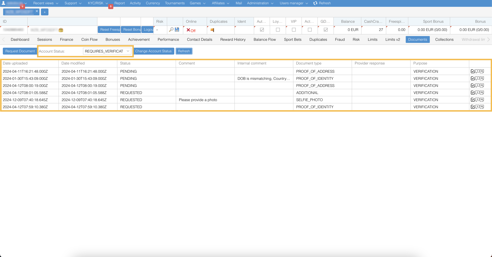
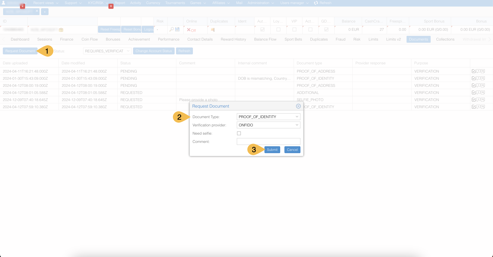
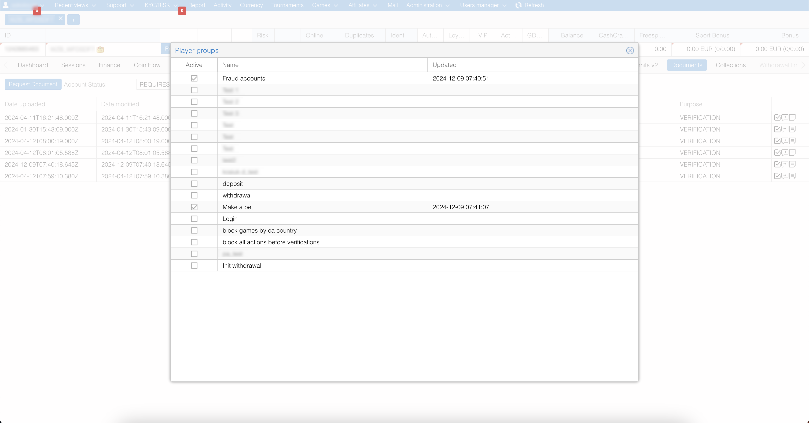
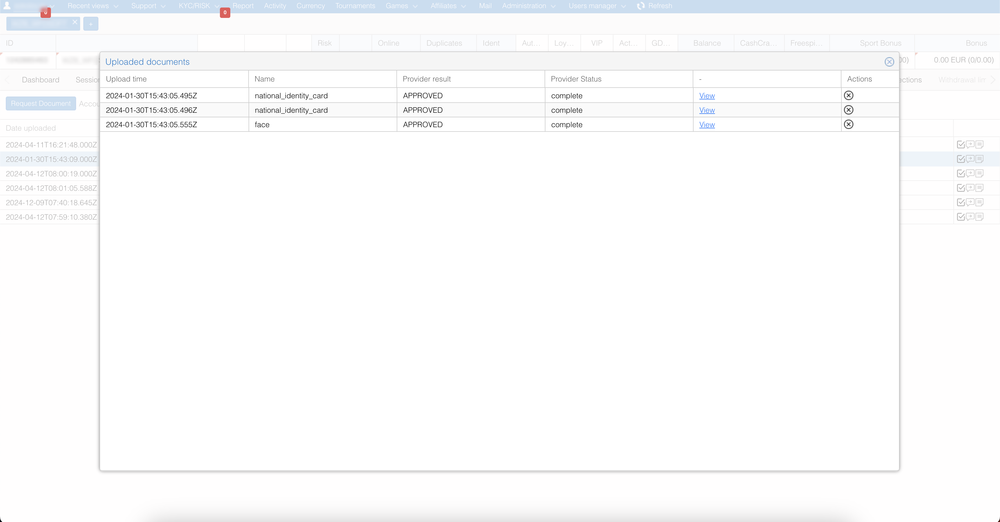
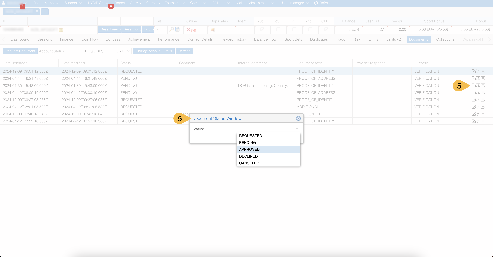

# Operator and Technical Guide for Document Verification

This guide provides a step-by-step walkthrough for operators managing the document verification process. It includes detailed technical workflows and validations.

## Workflow overview

1. Navigate to a player’s documents.
2. Request documents.
3. Assign the player to restriction groups.
4. Wait for the player to upload the requested documents.
5. Collect the uploaded documents.
6. Verify the documents.
7. Complete the verification process.

## Step-by-Step Instructions

### 1. Navigate to a player’s documents

On a player’s account page, open the **Documents** tab and then click the **Refresh** button. You will find the following there:

* **Account Status**: Current state of the player’s verification process.
* Documents: List of requested or uploaded documents with details such as *type*, *status*, and *provider’s response*.
* Actions: Options to request documents, update document statuses, and leave comments.
And more.

### 2. Request documents

In the player’s **Documents** tab:

1. Click the **Request Document** button to open the **Request Document** dialog.
2. Fill in the following fields in the dialog:
   * **Document Type**: Select from the predefined types such as `PROOF_OF_IDENTITY` (mandatory for Onfido), `PROOF_OF_ADDRESS`, `TRANSACTION_HISTORY`, `PROOF_OF_BANK_ACCOUNT_OWNERSHIP`, or others.
   * **Verification provider**: Select from the predefined options such as `ONFIDO` for automatic verification (required for `PROOF_OF_IDENTITY`) or `BACK_OFFICE` for manual verification.
   * **Need Selfie**: Select the checkbox if the player is required to upload a selfie photo too.
   * **Comment**: Add notes or instructions for the player (optional).
3. Click the **Submit** button to finalize the request.

Upon submission:

* The player’s Account Status changes to `REQUIRES_VERIFICATION`.
* You are prompted to assign the player to a restriction group in the open **Player groups** dialog (see the following step).

### 3. Assign the player to restriction groups

In the **Player groups** dialog, assign the player to one or more restriction groups to limit their account activities until verification is complete: “Fraud accounts”, “deposit”, “withdrawal”, “block all actions before verification”, etc.

### 4. Wait for the player to upload the requested documents

Once the request is made, the player is notified that they must upload the required documents in specific file formats in the UI.

### 5. Collect the uploaded documents

All documents uploaded by the player are automatically collected and displayed on the player’s **Documents** tab (see the figure in step 1). You will find the following there:

* **Date uploaded**: Date and time when a document was uploaded by the player.
* **Document type**: Type of the uploaded document.
* **Provider response**: Reaction or outcome from the verification provider, such as Onfido verification results.
* **Status**: Current processing status of the uploaded document, such as `REQUESTED`, `PENDING`, `APPROVED`, `DECLINED`, or `CANCELED`.
* And more.

### 6. Verify the documents

The uploaded documents can be verified either automatically (Onfido) or manually.

**Automatic Verification via Onfido**

If the verification provider is `ONFIDO`, the system processes the documents as follows:

1. The documents are sent via the *Upload API*.
2. Results are fetched via the *Verification API*.

The possible outcomes are:

* `APPROVED`: Document is valid.
* `DECLINED`: Document does not meet the requirements.

**Manual Verification via the V2 Platform (NR1) backoffice**

If the verification provider is BACK_OFFICE or Onfido’s verification has failed:

1. Double-click the document record in the Documents tab.
2. Click View in the open Uploaded documents dialog.

3. Examine the document’s details for compliance and accuracy.
4. Close the **Upload documents** dialog.
5. Click the respective checkbox icon within the Documents table to update the document’s status in the open **Document Status Window** dialog:
   * `APPROVED`: Document meets the requirements.
   * `DECLINED`: Document does not meet the requirements.
   * `PENDING`: Further review is needed.
6. Click the **Submit** button.

You can also click the other icons, located next to the checkbox icon, to

* Send a message to the player via the open **Document Comment Window** dialog.
* Leave an internal note visible only to backoffice operators via the open **Document Internal Comment Window** dialog.

### 7. Complete the verification process

After all the documents have been uploaded and reviewed, you need to make a final decision regarding the player’s account status:

1. Change the Account Status in the **Documents** tab (see the figure in step 1):
   * `VERIFIED`: Player’s account is successfully verified.
   * `FAILED_VERIFICATION`: Player’s documents have not met the requirements.
   * `PENDING_VERIFICATON`: More time or additional information is needed to make a final decision.
2. Remove the restrictions imposed during the verification process if the player’s account has been verified.

## Technical details

### Key validations

**File uploads:**

* File size: Up to 5 MB.
* File format: JPEG, PNG, PDF, JPG.
* Duplicate prevention: Files with duplicate names are not allowed.

**Document status transitions:**

* `REQUESTED` → `PENDING` → `APPROVED`, `DECLINED`, or `CANCELED`.

### API integration for Onfido

**Upload API:**

* Endpoint: `{base_url}/onfido/document/upload`.
* Sends documents with metadata for verification processing.

**Verification API:**

* Endpoint: `{base_url}/onfido/document/status`.
* Retrieves verification results for further processing.

### Notifications

**Required verification notification:**

* Triggered when the player’s account status changes to `REQUIRES_VERIFICATION`.
* Displayed across all brand pages, except “Verification” page, “Game” page, “Bonus” frames, and “403 Error” page.

**Successful verification notification:**

* Triggered when the player’s account status changes to `VERIFIED`.
* Displayed notification text: "Account was successfully verified!"

### Error Handling

**File upload errors:**

* If more than 5 files are uploaded, display: "Please choose only 5 files for uploading."
* If no file is uploaded, display: "Please upload documents for verification."
* If some uploaded files contain errors, display: "Some documents contain errors, please remove them and try again."

## Best Practices

* Use Onfido‘s automated verification for `PROOF_OF_IDENTITY` to minimize manual workload and improve efficiency.
* Assign players to restriction groups to prevent unauthorized activity while verification is in progress.
* Regularly review pending documents to avoid unnecessary delays.
* Leave concise and informative internal comments to facilitate better collaboration within your team.
