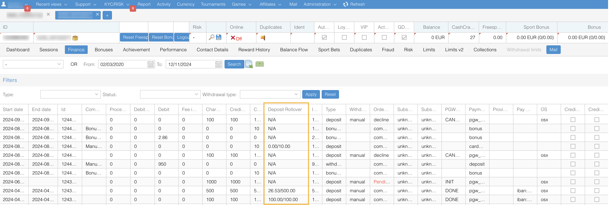
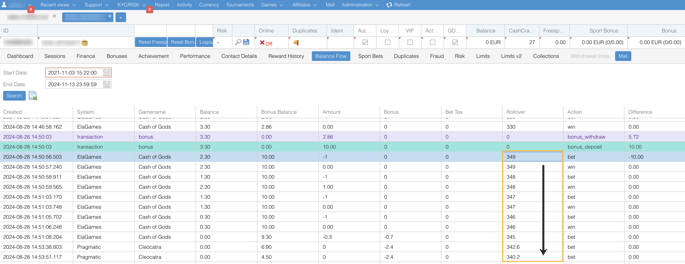
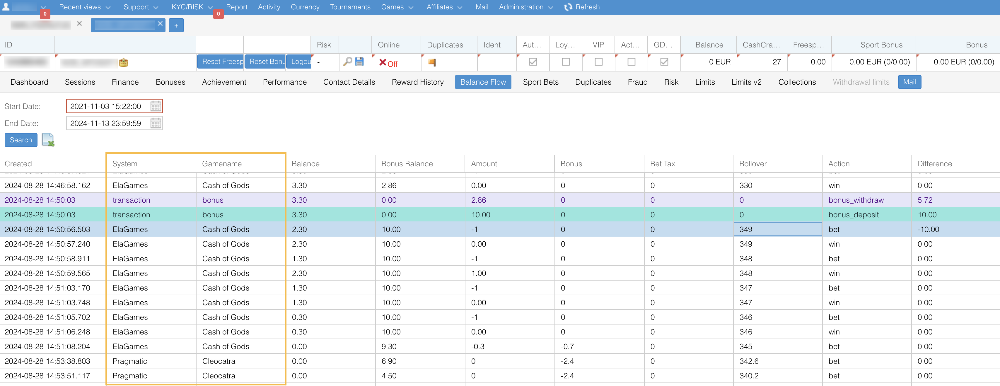
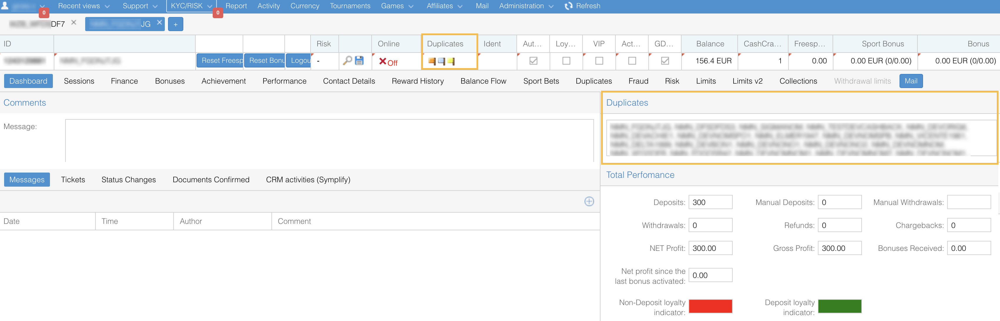
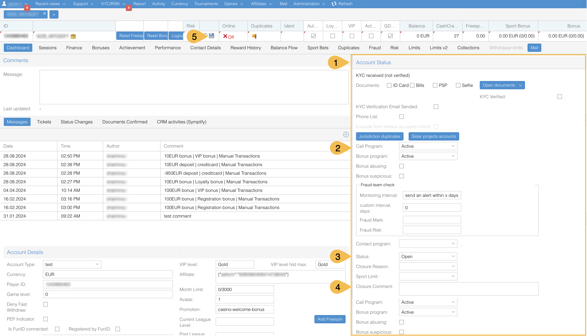
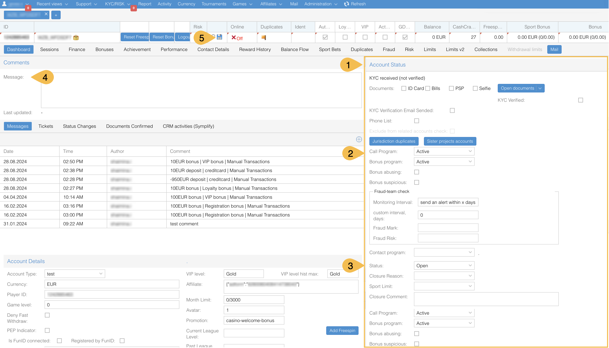
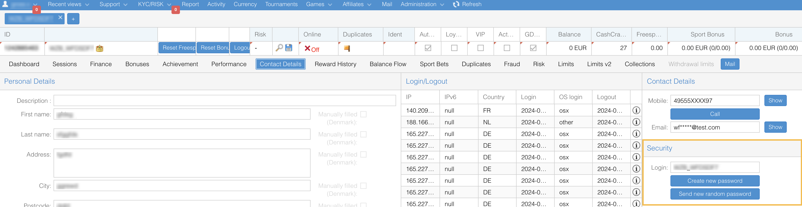

# FAQ
This section provides answers to commonly asked questions.

## How can I check a bonus wagering progress?
* You can go to the **Finance** tab and check the **Deposit Rollover** column, which shows the total wagered amount against the required wagering amount.

* Alternatively, you can go to the **Balance Flow** tab:
  * **Bonus balance** column shows the total available bonus amount.
  * Bonus column displays the wagered amount from the bonus balance.
  * Rollover column indicates the progress of the wagering process.
> Note that the overall amount in the **Deposit Rollover** column decreases with each bonus wager.

## How can I track the gameplay history?
You can verify the list of games the player has launched and placed bets on via the **Balance Flow** tab.

## How are duplicated accounts marked?
If a player’s account contains details that overlap with another player’s account, corresponding flags will appear on the player’s panel:
* **IP**: At least one other player has registered with the same IP address.
* **Email**: The registered email matches an existing player’s email.
* **Password**: The same password has been used by at least one other player.
* **Login**: The username matches another player’s username.
* **Phone**: The same phone number has been used by at least one other player.
* **Withdrawal Account**: The payment instrument details (bank account or payment card) match those of another player’s account.

Potential duplicate accounts are also displayed in the **Dashboard** > **Duplicates** section. For a detailed review, open the **Duplicates** tab to view the current duplicate data.

## How can I close a player's account?
Find a player’s account in NR1 and navigate to the **Dashboard** tab.
1. Go to the **Account status** section. 
2. Set the **Call Program** and **Bonus Program** to "Closed". 
3. Change the **Status** to "Closed" and select a reason for closure. 
4. Add a closure comment. 
5. Save the changes.

> To apply the changes:
> * Log out of your account in NR1.
> * Log back in and refresh the page to confirm that the account has been closed.

## How to re-open a player’s account?
Find a player’s account in NR1 and navigate to the **Dashboard** tab.
* Go to the **Account status** section.
* Set the **Call Program** and **Bonus Program** to "Active".
* Change the **Status** to "Open".
* Add the comment in the **Messages** section.
* Save the changes.

> To apply the changes:
> * Log out of your account in NR1.
> * Log back in and refresh the page to confirm that the account has been re-opened.

## How to reset a player's password?
A player has three options to reset their password:
* **Via their profile**: Players can reset their password on their own when logged in.
* **Using the "Forgot Password" option**: If they don’t remember their password, they can click **Forgot Password** on the login page to receive a reset email. 
* **By contacting support**: If they don’t receive a reset email after using the "Forgot Password" option, they can contact support for assistance.

_**What is the process when a player contacts support to reset their password?**_

Before resetting a player’s password, follow this **Basic Troubleshooting** checklist:
1. Confirm the player is using the correct username. 
2. Ensure their account is open, not closed or frozen. 
3. Verify the following:
   * The player is not copying/pasting their password and accidentally including whitespace. 
   * The player is using correct capitalization where required. 
   * The Caps Lock key is off or on as appropriate. 
   * The keyboard is set to the correct language. 
   * The username is being entered in the username field and the password in the password field (not vice versa). 
   * The player is not entering their email address as a username.

If their account is closed or frozen, resolve the issue based on the reason the account was initially closed.

_**What happens if a player fails multiple login attempts?**_
If a player fails 10 consecutive login attempts, their account will automatically be frozen, and the platform will set their Bonus Program to "Closed".
To check this status, go to the **Account Status** section in NR1 after opening the player’s account with a frozen password.

_**How do I unfreeze an account frozen due to failed login attempts?**_
If a player’s account is frozen due to entering the wrong password:
1. Change the **Bonus program** to "Active". 
2. Change the **Status** to "Open". 
3. Generate a new password:
   * Navigate to the **Contact Details** tab > **Security**. 
   * Click **Create new password**. 
   * Enter the new password twice and click **Submit**. 
   * Share the new password with the player.

## How to exclude players from bonus program?
The platform supports excluding players from receiving bonuses via **Bonus abusing** and **Bonus suspicious** functions. For more information, see the _Bonus abusers detection_ article.

## How to add affiliate identifier to the platform?
Affiliate identifiers are created automatically in the database after a player’s first registration on a brand website. To add a new affiliate identifier:
1. Register an account using the affiliate link provided by the Affiliate Manager. 
2. Once registered, change the user type to '_test_'. 
3. Wait for 30-40 minutes for the affiliate identifier to become available for use.

Check that the affiliate identifier is already stored on the platform: navigate to **Support** >  **Autobonus**, start creating a new autobonus, and select the **Affiliate ID** value in the dropdown list.