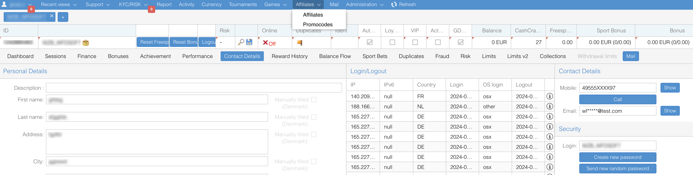
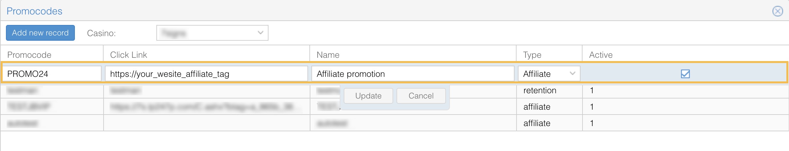
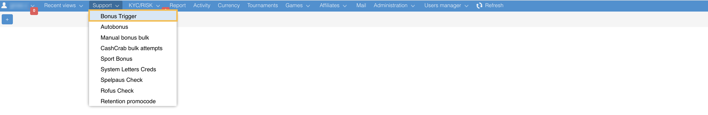
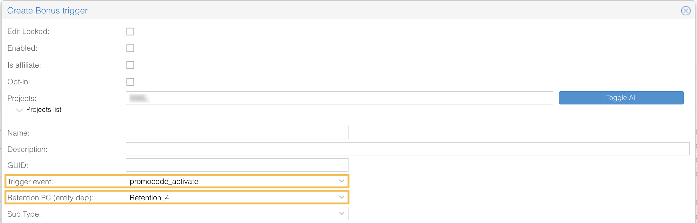

# Promocodes
Promocodes are unique triggers that can be used in various scenarios. They enable specific actions or rewards based on predefined configurations. For instance, an affiliate partner can provide a unique promotion code that allows players who register on a brand's website to receive exclusive bonuses.
To work with promocodes, follow these general steps:
1. **Create a promocode**: Generate a promocode within the platform and configure its parameters.
2. **Link the promocode to a bonus trigger**: Associate the promocode with a bonus trigger to define the rewards or actions tied to the promocode. 
3. **Share and activate**: Provide the promocode to the affiliate partners and players and ensure it is active on the platform.

NR1 allows you to create two types of promocodes:
* **Affiliate promocodes**: Allows players to use specific codes during registration to receive unique offers or bonuses.
* **Retention promocodes**: Designed to re-engage existing players, offering them rewards for specific actions (e.g., returning to the brand website, making deposits, etc.).

## Affiliate promocodes
Steps to create an affiliate promocode:
1. Go to Affiliates > Promocodes.

2. Click the Add new record button.
3. Select your project from the drop-down list.
4. Specify the parameters:

   * **Promocode**: Promocode value that will be shared with players.
   * **Click link**: Affiliate link for the advertisement campaign containing an affiliate tag.
   * **Name**: Name of the promocode in NR1. 
   * **Type**: Promocode type, should be “affiliate”.
   * **Active**: Checkbox for promocode activation.

Once you're created the promocode, you need to link it to a corresponding bonus trigger. 
1. Go to **Support** > **Bonus Trigger**.

2. Click **Create new**, choose your project, select **Is affiliate** checkbox. 
3. Fill the previously created promocode in the **Promocode (entity dep)** field. 
4. Configure the bonus trigger as needed.

## Retention promocodes
Steps to create an affiliate promocode:
1. Go to **Support** > **Retention promocode**.
2. Click the “Plus” icon. 
3. Configure the following parameters:
   * **Code**: Retention code value that will be shared with players.
   * **Name**: Name of this promocode in NR1.
   * **Active**: Checkbox for promocode activation.
   * **Max count**: Limit of usage this promocode.
   * Select days of a week when this promocode should be active.

Once you’ve created the promocode, you need to link it to a corresponding bonus trigger.
1. Go to **Support** > **Bonus Trigger**.

2. Select your project.
3. Set the **Trigger event** as “promocode_activate”.
4. Select **Retention PC** from the drop-down list.

